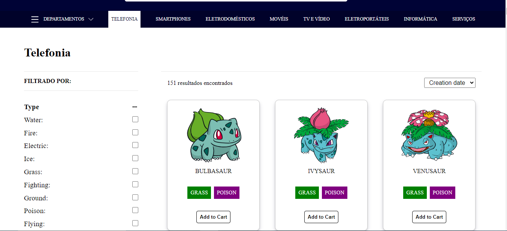
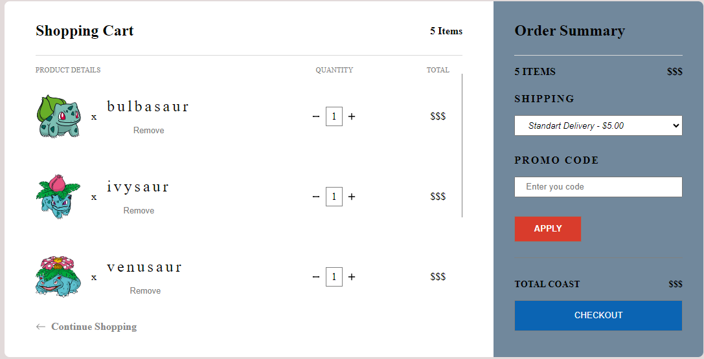

# Ecommerce Amerifan

Projeto de E-commerce desenvolvido para testar minhas competências em react, next, na construção de páginas web, performance e todo processo de desenvolvimento web.

## Stack utilizada

**Front-end:** React, Next, Typescript, Styled components, React query, SWR, consumo de API, Localstorage, Context API, SSR, SSG, CSR.

## Demonstração

React: https://e-commerce-amerifan.vercel.app/

Next: https://nexts-e-commerce-amerifan.vercel.app/

## Screenshots

Home page

Filtragem

Login

Cadastro

Carrinho

PageSpeed

## Funcionalidades

- Login
- Cadastro
- Buscar produto
- Listagem de produtos por: ordem de criação, nome e tipo
- Filtragrem de produtos por: tipo e cor
- Ver informações do produto
- Selecionar atributos do produtos
- Adiconar ao carrinho
- Selecionar a quantidade de Itens no carrinho

## Apêndice

Projeto seguindo as métricas do web core vitais para uma melhor otimização de paginas e experiência do usuário. (pagespeed)
Tive preocupações extras com desempenho, bastante foco em re-render desnecessários e derived states. Foi aplicado a técnica de Code splitting, usada para dividir o código em pequenos pedaços que são carregados sob demanda, com React.Lazy, com isso, foi preciso se atentar a algumas mudanças de Cumulative Layout Shift (CLS). A estrutura de pasta e o modelo de desenvolvimento seguem de acordo com alguns artigos estudados, aplicações de alguns conceitos de SOLID ao front end e como eu acredito, neste caso, a melhor abordagem para esse projeto.

Foram utilizados diversos metodos de array, strings, bastante conhecimento em react, conhecimentos em modelos de construção de páginas web e para onde está seguindo com next 13 dentre vários conceitos de desenvolvimento web. Também tiveram alguns probleminhas que foram encontrados ao longo do projeto que só quem desenvolve entende e como é preciso quebrar a cabeça pra conseguir achar uma solução satisfatória.
